Dick Smith System 80 Restoration
================================

This repository chronicles my exploits in restoring a Dick Smith System 80
that I got off eBay.

## Technical specifications

* Z-80 8-bit CPU, running at 1.77MHz.
* 12K of ROM containing BASIC.
* 1K of video RAM for 64 x 16 text mode or 128 x 48 graphics mode.
* 16K of user program RAM, expandable to 48K using an expansion module.

### Initial condition of the unit

According to the seller on eBay, the unit had been sitting in a shed for
30+ years.  The original owner is into boating.  I'm guessing the shed
was near the seaside from the corrosion inside!

The unit was in pretty rough shape cosmetically.  Lots of dirt, cable burns,
missing cassette stickers for play/pause/stop/etc, and broken pieces in the
ventilation at the back (right-click and open in a new tab for a
larger version):

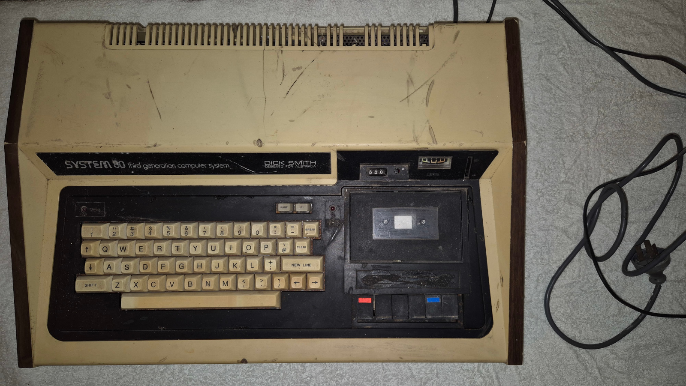

The bottom was in relatively good condition with some cable burns
The nameplate sticker was missing but the serial number and QA stickers
were still present.  Serial number 281001.

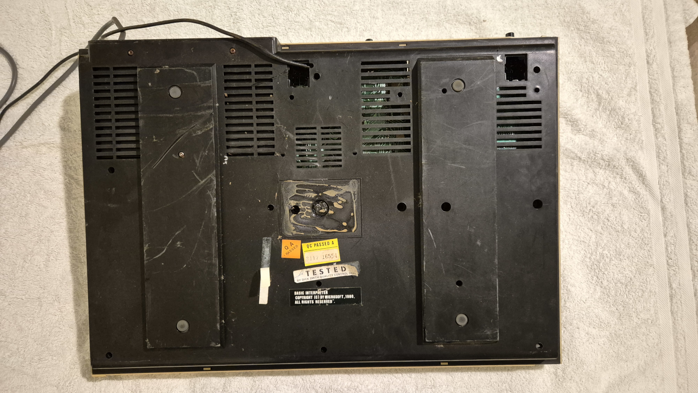

Here are some closeups of the outside:

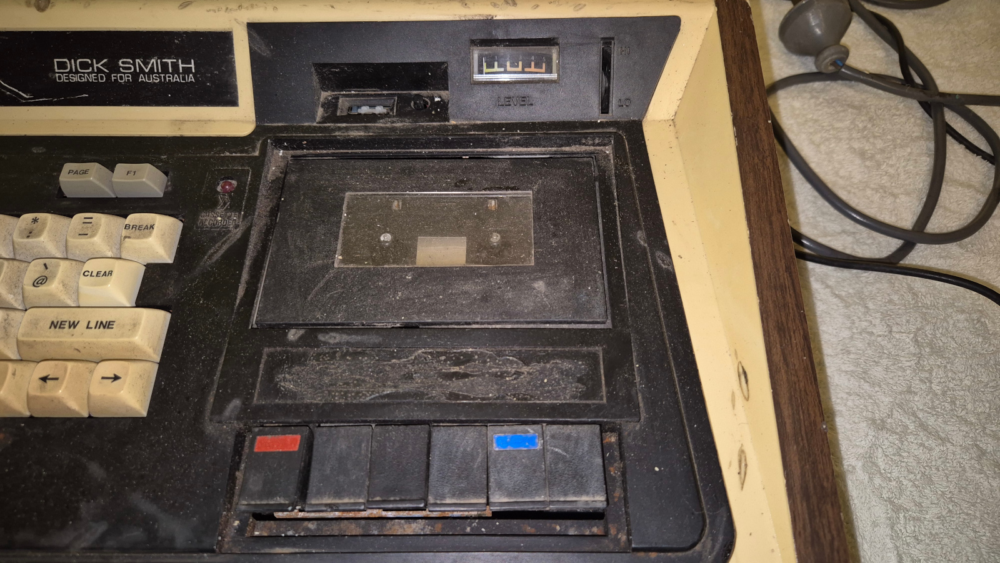

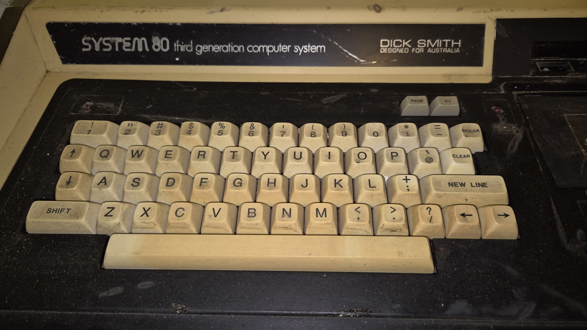

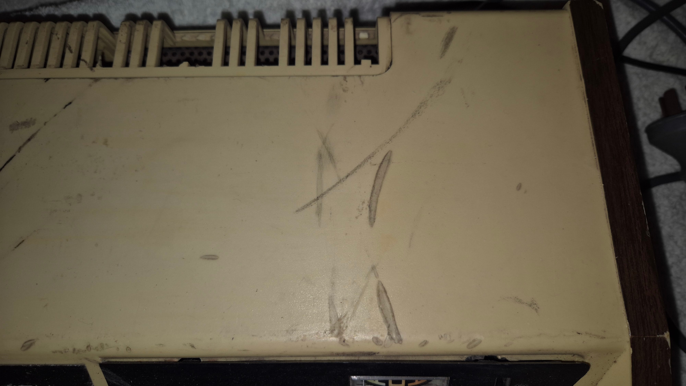

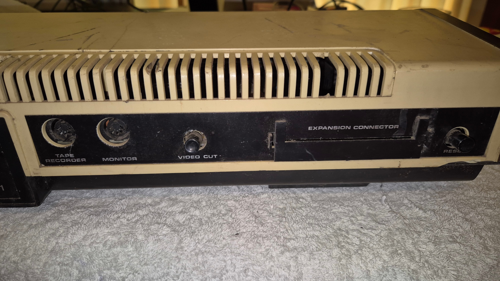

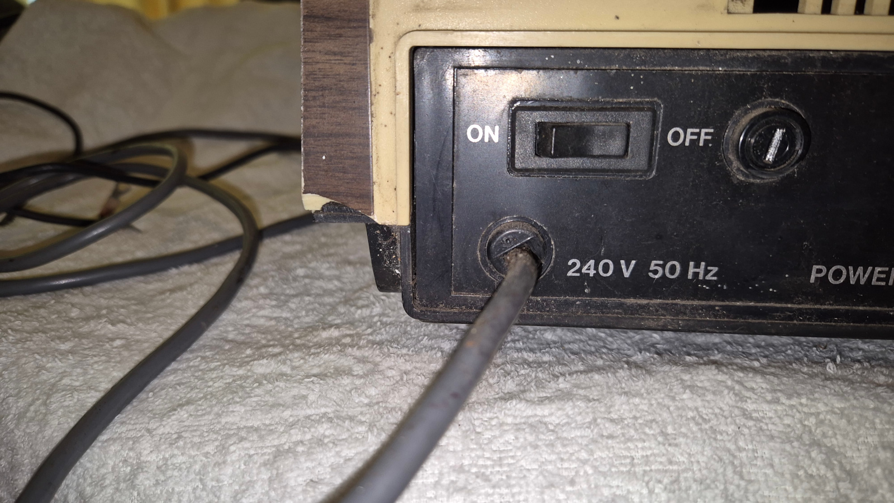

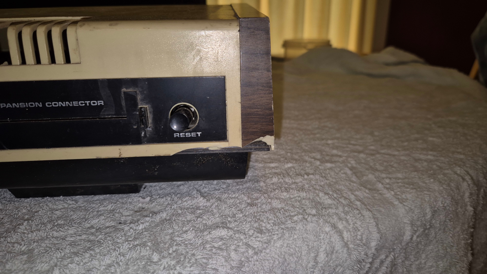

Inside was a lot of dirt and rust!

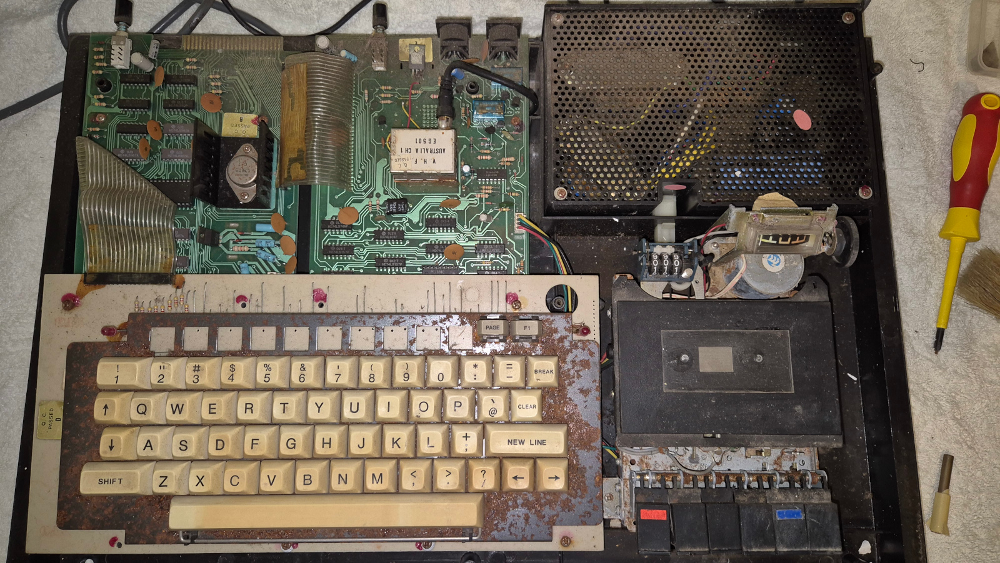

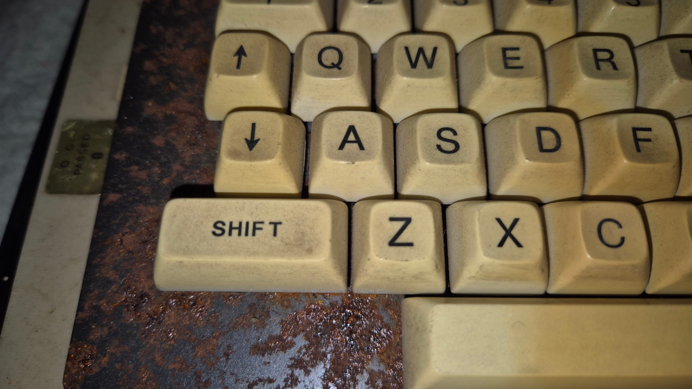

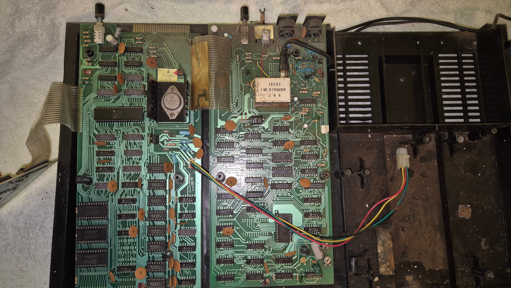

The cassette mechanism was completely rusted out and the motor was seized up.
Not sure what I can do about this at the moment.

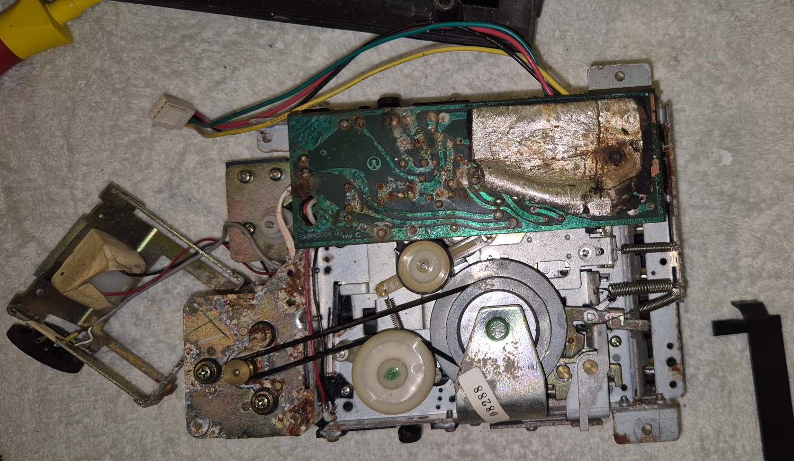

### Cleaning

I pulled everything apart and cleaned the case and keyboard as best
as possible.  Something needs to be done about the cable burns and the
broken pieces later.

### Chip testing

Next, I pulled all of the chips that were in sockets and ran them through my
[BackBit Chip Tester Pro V2](https://store.backbit.io/product/chip-tester/).

Main board:

* Z5 - Z-80 CPU - Failed with "BAD ADDR" error.  I already had a replacement.
* Z10 - E3001 BASIC ROM - Good when tested with chip type "2332".
* Z11 - E3002 BASIC ROM - Good when tested with chip type "2332".
* Z12 - E3003 BASIC ROM - Good when tested with chip type "2332".
* Z27 - HM4716AP-4N 16Kx1 Dynamic RAM - Not testable.
* Z28 - HM4716AP-4N 16Kx1 Dynamic RAM - Not testable.
* Z29 - HM4716AP-4N 16Kx1 Dynamic RAM - Not testable.
* Z30 - HM4716AP-4N 16Kx1 Dynamic RAM - Not testable.
* Z31 - HM4716AP-4N 16Kx1 Dynamic RAM - Not testable.
* Z32 - HM4716AP-4N 16Kx1 Dynamic RAM - Not testable.
* Z33 - HM4716AP-4N 16Kx1 Dynamic RAM - Not testable.
* Z34 - HM4716AP-4N 16Kx1 Dynamic RAM - Not testable.

I wasn't able to test the DRAM chips because I need an adapter to provide the
-5V and +12V supply rails, which I do not presently have.  But since BASIC
ran fine later (see below), I'm guessing the DRAM's are ok.

Video board:

* Z17 - MM2114-N 1Kx4 Static RAM - Good.
* Z18 - MM2114-N 1Kx4 Static RAM - Good.
* Z25 - 52116 Character Generator ROM - Good when tested with chip type "2532".

The dumped ROM images are in the `ROMs` directory of this repository.

In the process of inspecting the PCB's and testing the chips, I found a
dead bug hiding under one of the capacitors.  Which I removed of course.
Don't want the bug causing issues for me later like the
[world's first computer bug](https://www.computerhistory.org/tdih/september/9/).

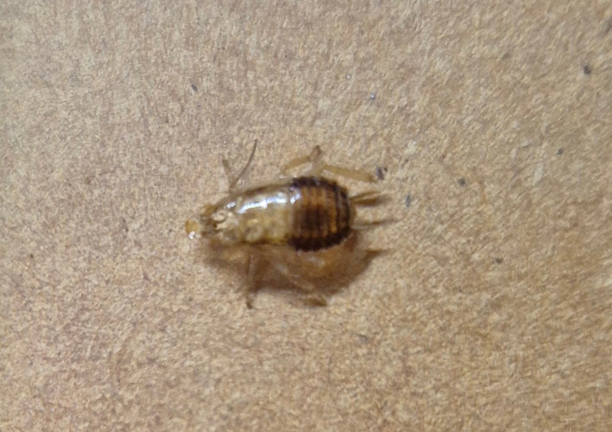

## Recapping the power supply

This was the initial state of the power supply:

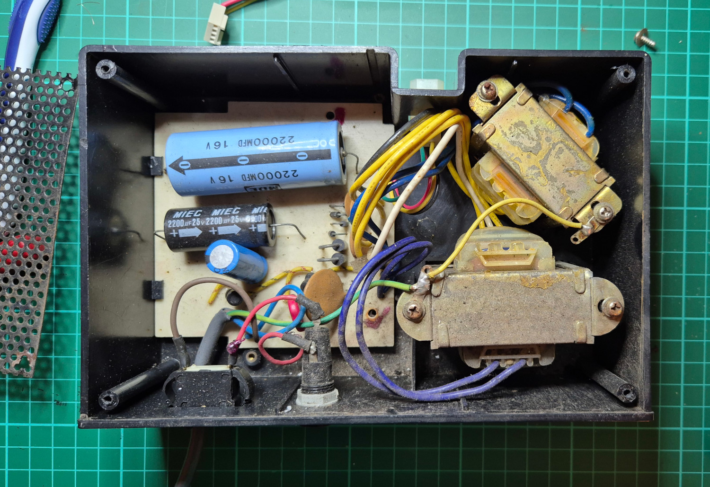

Other than the dirt, the only glaring issue was the three big electrolytic
capacitors.  The date codes on the chips on the motherboard are from 1981,
so these capacitors are around 45 years old.  I didn't even bother to
test them - I just replaced them.

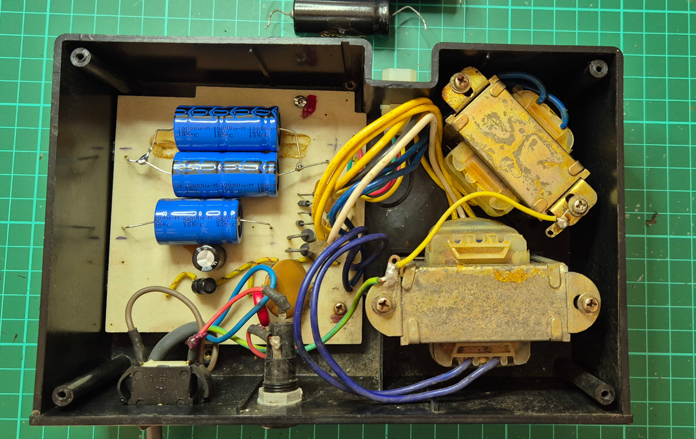

The three original capacitors were:

* 22000uF, 16V - replaced with two 10000uF, 16V capacitors in parallel.
* 2200uF, 25V
* 1000uF, 25V

The voltage outputs seemed fine if a little high.  Probably due to no load.
It was time to power on the main PCB's.

## Power on smoke test

I reconnected everything except the cassette deck, crossed my fingers,
and turned it on.  The LED's on either side of the keyboard turned on.
That's a good sign.

The 5V rail on the CPU board was 5.05V.  On the video board it was 4.99V.
12V rail was 12.15V.  -5V rail was -5.06V.  Perfect.

The 10.64MHz crystal was oscillating at 10.64MHz according to my
oscilloscope.  Also perfect.

The ROM chips were running a little hot.  Not sure if that is a problem
or not yet.

I could see a composite video signal of some sort on the monitor output
port with my oscilloscope.  But my RetroTink had difficulty locking
onto the signal to display an image.  Then I saw a "Ready?" prompt!  Yay!

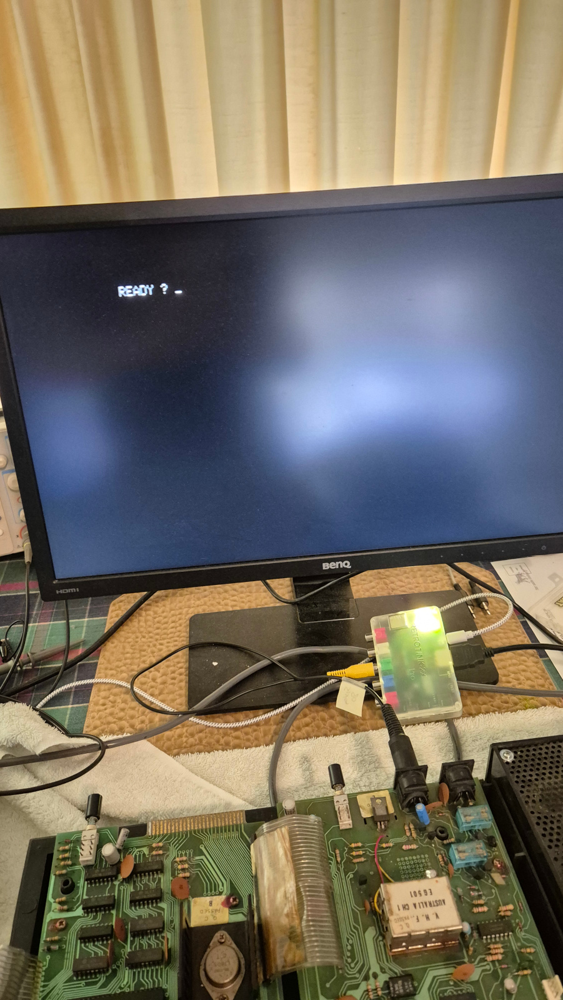

The video cuts in and out which is very annoying, but I was able to test
the keyboard.  Some of the keys don't work or are intermittent and bouncy.
I did manage to type a simple `10 PRINT "HELLO WORLD"` program once,
but didn't get a photo.  Some keys like T and N only work now and then.

### What's working so far?

* Power supply.
* Z-80 CPU (after I replaced it as described above).
* BASIC ROM's.
* 16K of dynamic RAM on the CPU board.
* 1K of static RAM on the video board.
* Video circuitry for HSYNC/VSYNC and video memory address generation.
* Character generator ROM.
* Composite video output.
* Most keys on the keyboard work, but some keys are flaky.

### In-depth testing and fault finding

Next steps:

* The video signal is not stable; it cuts in and out.
* Deal with the keys on the keyboard that are intermittent or bouncy.
* ROM's run a little hot.  Probably OK.
* Deal with the corrosion on the expansion port connector and keyboard.
* Deal with the cassette deck - it may be a lost cause.

### Flaky video signal

My brother found a composite-to-RGB converter for cheap at an end of
financial year sale for a local electronics retailer.  The composite-to-RGB
converter didn't work with other computers like my Dick Smith Cat,
but it worked perfectly with the System 80!

It looks like the video problem was with the RetroTink all along,
not with the System 80.

The video is a little shaky, but I can live with it for now.

### Non-working keys on the keyboard

I found the problem with the keyboard.  With all of the handling of the PCB,
metal fatigue in the wires built up and snapped two of the wires on the
keyboard ribbon cable (right-click and open in a new tab for a larger version):

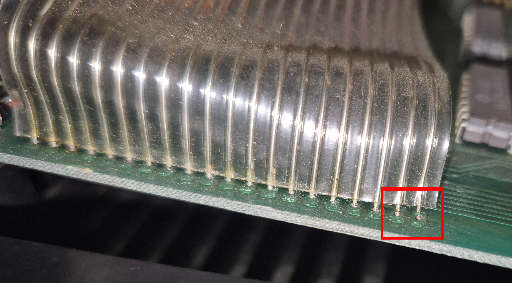

This type of soldered ribbon cable is a real pain in the neck.
Even minor board handling will tear them off if you aren't careful.
There were similar cables on
[a VZ200 and a VZ300 that I restored previously](https://github.com/rweather/vz200-restoration).

Those two wires correspond to the columns containing the intermittent
keys like N and T.  No wonder I was having problems typing "PRINT" in BASIC.
I was able to type in a "HELLO WORLD" BASIC program just one time.
I guess the cable was angled to make the wires touch briefly that one time.

I replaced the cable with something easier to repair in the future if a
wire comes loose:

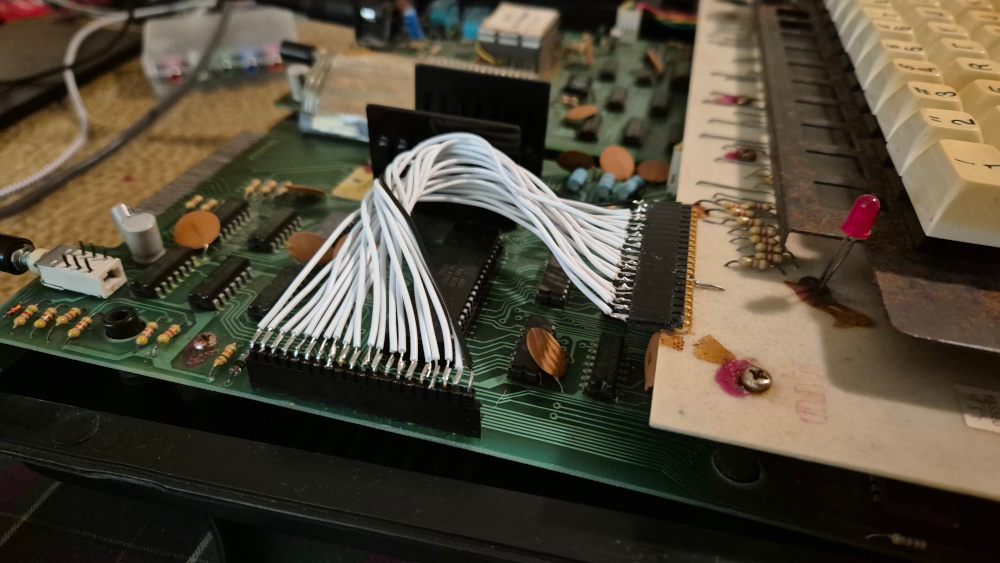

I then tested all of the keys.  Some of them were very flaky.  Testing
them with a multimeter showed some at 20 Mohms when pressed.  Probably
corrosion in the contacts.  I pounded the keys a few dozen times and
they came good!

Some keys like N and I are still a little bouncy, but as long as I don't
type too fast they are ok.  Unfortunately, my natural typing speed is fast!

### Summary of changes made

Here is a summary of the changes that I made:

* Cleaned the case, keyboard, PCB's, etc.
* Replaced the filter capacitors in the power supply.
* Replaced the Z-80 CPU with a new one, as the original was broken.
* Desoldered the RF video cable from the RF modulator.  Analog television
  sets are very rare these days and composite video works fine.
* Modified the keyboard ribbon cable and connectors to be easily repairable.

Costs (in AUD):

* $500 for the System 80 off eBay.
* $27 to replace the filter capacitors in the power supply.

## Schematics

I have reproduced some of the schematics from the Technical Manual in KiCad
and generated PDF versions.  The original schematics can be hard to read.

* [System 80 Main Board](schematics/System_80_Main_Board/PDF/System_80_Main_Board.pdf)
* [System 80 Video / Cassette Board](schematics/System_80_Video_Cassette/PDF/System_80_Video_Cassette.pdf)
* [System 80 Power Supply](schematics/System_80_Power_Supply/PDF/System_80_Power_Supply.pdf)
* [System 80 Keyboard](schematics/System_80_Keyboard/PDF/System_80_Keyboard.pdf)

## Adapting the schematic

In theory the KiCad schematics could be modernised and then laid out on
brand new PCB's.  But a lot of work would be required to add footprints
and lay everything out.

The components in the System 80 are mostly bog-standard Z-80, memory, and
TTL logic chips that can still be sourced today.  The main exception is
the character generator ROM, but that could be replaced with a modern EEPROM.

Making a new System 80 from scratch wouldn't be difficult.  But some things
would be easier with modern components:

* Use a single 16K EEPROM instead of separate 4K EPROM's.
* Use static RAM chips like the 32K 62256 for system memory, instead of
dynamic RAM.  This removes a lot of complexity from the memory interface.
* Replace the 6-way 74LS367 bus transceivers with the 8-way 74LS244 and
74LS245 instead to reduce the number of transceiver chips.
* Replace the 5-pin composite video connector with a standard RCA jack.
* Replace the character generator ROM with a modern EEPROM and include the
graphics characters in the EEPROM.  This removes the need for a separate
circuit for rendering the graphics characters.

## License

System 80 Restoration by Rhys Weatherley is licensed under <a href="http://creativecommons.org/licenses/by-nc-sa/4.0/?ref=chooser-v1" target="_blank" rel="license noopener noreferrer" style="display:inline-block;">Attribution-NonCommercial-ShareAlike 4.0 International</a>

## Contact

For more information on this project, to report bugs, or to suggest
improvements, please contact the author Rhys Weatherley via
[email](mailto:rhys.weatherley@gmail.com).
