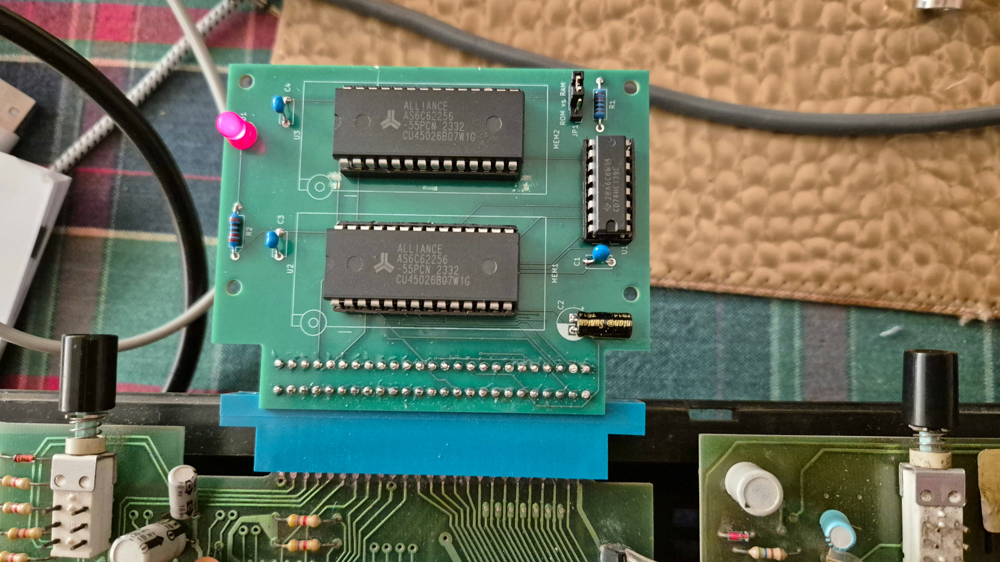
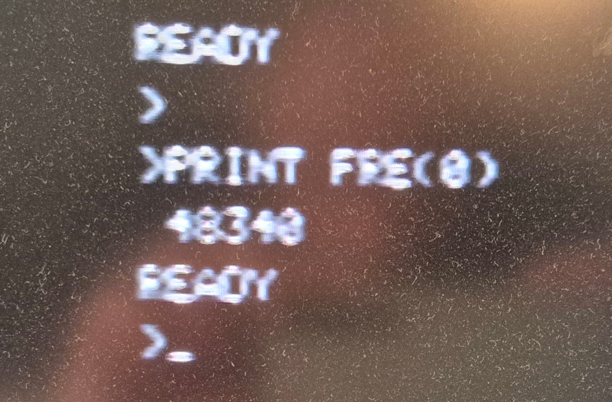

Memory Cartridge for the Dick Smith System 80
=============================================

This page describes the design of my "Memory Cartridge" that plugs into the
expansion interface on the back of the System 80.

My System 80 has 16K of RAM on-board between $4000 and $7FFF.
The cartridge populates the rest of memory between $8000 and $FFFF.
It can be configured with either two 16K static RAM chips, or one 16K
static RAM chip at $8000 to $BFFF and one 16K EEPROM at $C000 to $FFFF.

The EEPROM option provides a simple way to load programs onto the
System 80 without using a cassette recorder or disk drive.

The [schematic](Memory_Expansion_Cartridge/PDF/Memory_Expansion_Cartridge.pdf)
and [Gerber files](Memory_Expansion_Cartridge/Gerber) are provided in
this repository.  The layout supports 28-pin ZIF sockets or regular sockets.

Here is a picture of the memory cartridge, populated with two RAM chips:

After restarting the System 80, we now have 48340 bytes of memory free
(apologies for my dusty and blurry screen):

Note: Due to the size and shape of the modern edge connector, it is necessary
to remove the top case from the System 80 to be able to insert the
memory cartridge.  I didn't realise this when I designed it.
